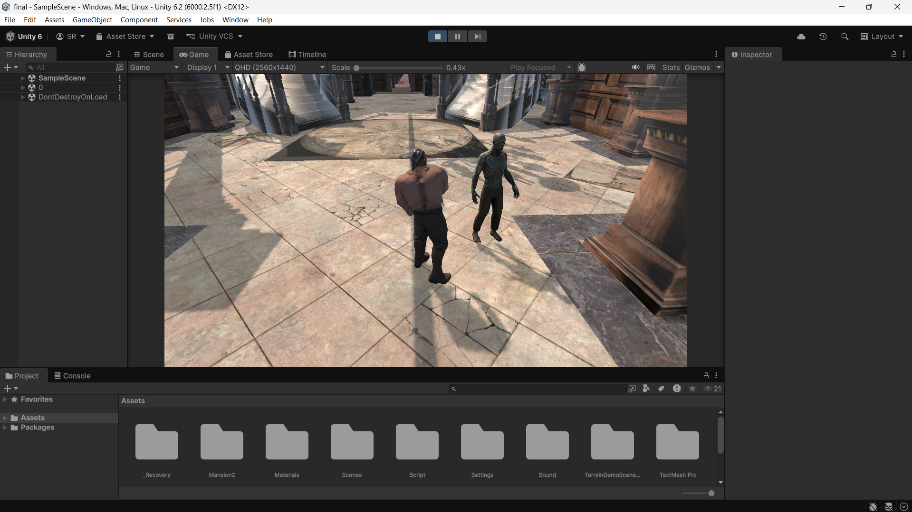
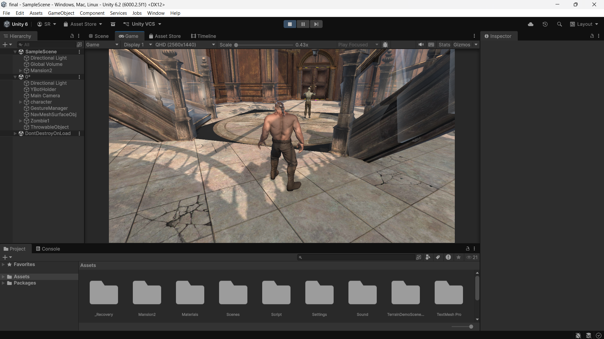
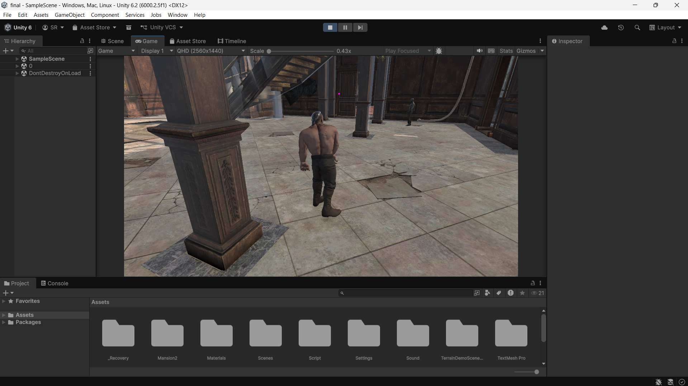

# 🧟 Zombie Survival AI Game (Unity)
## 📸 Gameplay Preview





An AI-driven zombie survival prototype built in Unity, featuring **gesture-based player interaction** and **sound-reactive zombie behavior**. The project combines **computer vision (MediaPipe)** with **game AI (FSM + NavMesh)** to create an interactive stealth-survival experience.

---

## 🎮 Core Features

### 🧠 Intelligent Zombie AI

* Default **player-follow behavior**
* **Sound-based investigation system** (object impact triggers)
* Dynamic switching between:

  * Follow Player
  * Investigate Sound
  * Attack
* Implemented using **Finite State Machine (FSM)** + **Unity NavMesh**

---

### ✋ Gesture-Based Interaction (MediaPipe Integration)

* Real-time hand tracking using **MediaPipe (Python)**
* Webcam captures gestures and sends them to Unity via UDP
* Supported gestures:

  * ✊ **Fist → Pick up object**
  * ✋ **Open Hand → Throw object**
* Enables **natural, controller-free interaction**

---

### 🔊 Sound-Driven Gameplay Mechanics

* Object collisions generate **sound events**
* Zombies detect sound within a defined radius
* AI responds by navigating to the **source of disturbance**
* Introduces **stealth and distraction-based gameplay**

---

### 🎭 Animation System

* Pickup and throw animations integrated with **Animator Controller**
* **Animation Events** used for:

  * Precise object attachment
  * Accurate throw timing
* Eliminates delay issues and ensures realistic motion sync

---

## 🛠️ Tech Stack

* **Unity Engine (C#)**
* **NavMesh (AI Pathfinding)**
* **Animator Controller (Animation System)**
* **Python + MediaPipe (Gesture Recognition)**
* **UDP Communication (Python → Unity integration)**

---

## 🧠 AI Architecture

The zombie behavior is implemented using a **Finite State Machine (FSM)**:

### States:

* **FollowPlayer (Default)**
* **InvestigateSound (Triggered on object impact)**
* **Attack (When player is in range)**

### Transition Logic:

* Sound detected → InvestigateSound
* Reached sound → Resume FollowPlayer
* Player in range → Attack

This architecture ensures **scalable and modular AI behavior**.

---

## ⚙️ System Architecture

```text
Webcam Input (MediaPipe - Python)
        ↓
Gesture Detection (Fist / Open)
        ↓
UDP Communication
        ↓
Unity Gesture Receiver
        ↓
Action Controller (Pickup / Throw)
        ↓
Physics + Sound Event
        ↓
Zombie AI reacts (FSM + NavMesh)
```

---

## 📂 Project Structure

```
Assets/
  Scripts/
  Animations/
  Prefabs/
  Scenes/
Packages/
ProjectSettings/
```

---

## 🚀 Setup & Installation

### 🔹 1. Clone the Repository

```bash
git clone https://github.com/yourusername/Zombie-Survival-AI-Unity.git
```

---

### 🔹 2. Open in Unity

* Open **Unity Hub**
* Add the project folder
* Recommended versions:

  * Unity **2022 LTS** or **Unity 6**

---

### 🔹 3. Install Python Dependencies (for Gesture Control)

Make sure Python 3.8–3.10 is installed.

Install required libraries:

```bash
pip install opencv-python mediapipe
```

---

### 🔹 4. Run Gesture Detection Script

Run your Python file (example):

```bash
python hand_tracking_test.py
```

Ensure:

* Webcam is working
* Gestures are detected correctly

---

### 🔹 5. Run Unity Scene

* Open the main scene in Unity
* Click **Play**
* Perform gestures:

  * ✊ Fist → Pick up object
  * ✋ Open → Throw object

---

## 🎯 Gameplay Flow

1. Player moves in environment
2. Picks up and throws object using gestures
3. Object creates sound on impact
4. Zombie detects sound and investigates
5. Zombie returns to player tracking or attacks

---

## 📌 Future Improvements

* Multi-zombie coordination system
* Sound intensity & direction modeling
* Advanced stealth mechanics (line-of-sight, hiding)
* ML-based gesture classification improvements
* UI feedback system

---

## 👨‍💻 Author

**Saurabh Raj**

---

## ⭐ Support

If you find this project interesting, consider giving it a **star ⭐** on GitHub!
